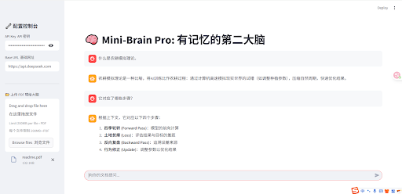

[English Version](readme_en.md)

# 🧠 Chat-Box: 基于 RAG 的个人第二大脑

"给你的文档装上大脑，让知识流动起来。"



---

## 📖 目录

- [项目简介](#-项目简介)
- [核心特性](#-核心特性)
- [技术架构](#️-技术架构)
- [快速开始](#-快速开始)
- [技术栈详情](#️-技术栈详情)
- [学习与致谢](#-学习与致谢)
- [贡献指南](#-贡献指南)
- [许可证](#-许可证)

---

## 🚀 项目简介

Chat-Box 是一个轻量级但功能强大的本地知识库助手，核心驱动技术采用了业界前沿的 RAG (检索增强生成) 架构。它不仅仅是一个简单的聊天机器人，更是一个能够“阅读”并“理解”你私有数据的智能外脑。

通用的大语言模型（LLM）虽然博学，但往往受限于训练数据的截止日期，且完全无法触及用户的个人隐私数据。Chat-Box 允许用户上传各类私有的 PDF 文档——无论是复杂的法律条文、晦涩的技术手册，还是零散的个人笔记——并建立专属索引。通过这一机制，它有效解决了通用模型在处理特定领域知识时常见的“幻觉”（胡编乱造）问题，同时弥补了模型对非公开数据认知的空白。

---

## ✨ 核心特性

- **🔒 隐私优先的本地化处理**: 所有的文件解析、文本切片以及向量化嵌入（Embedding）过程均在本地环境中完成。这意味着你的敏感数据（如合同、财报）无需上传至第三方向量云服务，极大降低了隐私泄露风险，确保数据安全可控。

- **🧠 上下文感知的记忆功能**: 内置智能的状态管理系统，具备多轮对话能力。它不仅能回答当前的问题，还能结合之前的对话历史进行推理，提供连贯、符合语境的回答，就像与一位真实的助手交流。

- **🔌 广泛的模型兼容性**: 底层架构设计灵活，默认支持标准的 OpenAI 协议。这意味着你可以轻松切换后端的大脑，无论是高性价比的 DeepSeek，还是强大的 GPT-4 或 Claude，都能无缝接入。

- **⚡ 极速的开发与部署**: 摒弃了传统繁重的 React/Vue 前端框架，基于 Python 原生的 Streamlit 构建。这使得全栈开发周期从数周缩短至数小时，且维护成本极低，让开发者能专注于核心的 RAG 逻辑优化。

---

## 🏗️ 技术架构

本项目采用经典的前后端分离（逻辑上）架构。虽然代码写在同一个 Python 文件中，但职能划分清晰，模拟了现代企业级 AI 应用的数据流转。

### 代码结构解析 (app.py)

| 模块          | 行数 (估) | 功能说明                                                                                                                                            | 技术栈             |
| --------------- | ------------ | -------------------------------------------------------------------------------------------------------------------------------------------------------- | ---------------------- |
| **前端配置** | 1-26         | 负责界面的初始化，包括设置页面标题、注入自定义 CSS 样式以优化阅读体验，以及构建响应式的侧边栏布局。 | Streamlit, CSS         |
| **状态管理**| 30-43        | 初始化并维护 `session_state`，这充当了应用的“海马体”，负责持久化存储对话历史和复杂的 Chain 对象，防止页面刷新导致记忆丢失。 | Python Memory          |
| **数据流水线**   | 46-97        | 核心 ETL 过程：实现了从非结构化数据（PDF）到结构化向量的转换。包含加载器调用、文本分块策略、向量化计算以及向量库的持久化存储。 | LangChain, ChromaDB    |
| **交互循环**| 100+         | 实现了标准的消息事件循环：渲染历史聊天气泡，监听用户输入，触发后端检索生成逻辑，并将结果实时反馈给用户。      | Event Loop             |

---

## 🚀 快速开始

### 1. 环境准备

确保你的电脑已安装 Python 3.8+。建议使用虚拟环境以避免依赖冲突。

```bash
# 克隆仓库
git clone https://github.com/[你的用户名]/chat-box.git
cd chat-box

# 安装依赖
# requirements.txt 包含了 LangChain 全家桶及向量处理所需的库
pip install -r requirements.txt
```

### 2. 运行应用

```bash
streamlit run app.py
```

### 3. 使用说明

1.  **配置大脑**：在左侧侧边栏输入 API Key。本项目推荐使用 DeepSeek API，因其完全兼容 OpenAI 接口且性价比极高，适合高频调用。
2.  **喂食知识**：点击上传按钮，选择一个 PDF 文档。系统会自动开始解析，当进度条完成并提示“✅ 大脑已激活”时，说明知识已注入。
3.  **开始对话**：在下方输入框提问。你可以询问文档中的具体细节，或者让 AI 总结全文。

---

## 🛠️ 技术栈详情

- **前端: Streamlit** - 选择 Streamlit 是为了极致的开发效率。它允许数据科学家用纯 Python 构建交互式 Web 应用，无需陷入 HTML/JS 的细节泥潭。
- **编排: LangChain** - 目前业界最流行的 LLM 应用开发框架。它提供了标准的接口来连接模型、向量库和文档加载器，极大地简化了 RAG 流程的构建。
- **向量数据库: ChromaDB** - 一个开源且对开发者友好的本地向量数据库。它轻量高效，无需配置复杂的服务器环境即可运行，非常适合快速构建和原型验证。
- **词向量模型: `all-MiniLM-L6-v2` (via HuggingFace)** - 一个经过微调的 Sentence-BERT 模型，它能在保持极高推理速度的同时，生成高质量的语义向量，且完全免费。
- **大语言模型: `DeepSeek-Chat` (via OpenAI 协议)** - 强大的推理后端，负责理解检索到的上下文并生成最终的自然语言回答。

---

## 📝 学习与致谢

本项目不仅仅是一个应用开发实战，更是作者从底层的 AI 原理（如反向传播、梯度下降、神经网络架构）向顶层应用层跨越的关键一步。从手写自动微分引擎（Principia）到构建完整的 RAG 产品，这一过程旨在打通从数学公式到商业级 AI 应用的全链路认知体系。

特别感谢开源社区提供的强大工具链，让个人开发者也能在本地构建出如此强大的 AI 应用。

---

## 🤝 贡献指南

欢迎各种形式的贡献！如果你有改进建议或发现了 Bug，请随时提交 Issue 或 Pull Request。

---

## 📜 许可证

本项目基于 MIT 许可证开源。详情请见 `LICENSE` 文件。

---

由 **[你的名字]** 创建 | 2025